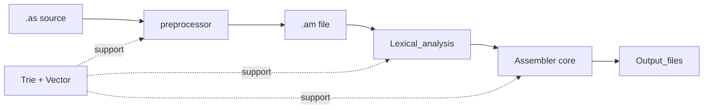

# Labratory ©️ 

[](#)
[](#)
[](#)


This is a **12-bit assembler** for the **System Programming Laboratory** course (20465) at the Open University of Israel.  
It is written in **ANSI C (C89)**, follows a modular layout, and transforms `.as` sources into preprocessed `.am` files and Base64-encoded object output.

---

## 📖 Table of Contents

- [A Glance](#-a-glance)
- [Project Structure](#-project-structure)
- [Getting Started](#️-getting-started)
- [Core Architecture](#️-core-architecture)
- [Build & Environment](#️-build--environment)
- [Testing](#-testing)
---

## 💡 A Glance

| Topic | Description |
|---|---|
| **Project Type** | 12-bit assembler with deferred symbol resolution |
| **Academic Context** | System Programming Laboratory (Open University) |
| **Language** | ANSI C (C89) |
| **Input / Output** | `.as` files -> `.am`, `.ob` (Base64), `.ent`, `.ext` |

---


## 🧩 Project Structure

### Project Map

| Directory | Responsibility |
|---|---|
| `Assembler/` | Orchestrates compilation, symbol handling, and backpatching. |
| `Lexical_analysis/` | Parses lines and classifies commands, directives, and operands. |
| `preprocessor/` | Handles macro expansion and writes the `.am` stage. |
| `Output_files/` | Generates `.ob`, `.ent`, and `.ext` files. |
| `Data_structures/` | Infrastructure for fast `Trie` lookups and dynamic `Vector` storage. |

### Flow Overview

The assembler operates in a modular pipeline: source files are expanded via the **preprocessor**, analyzed for **lexical patterns**, and then processed by the **core logic** to resolve labels and generate encoded machine words.


## ⚙️ Getting Started

### 1. Clone the Project

```bash
git clone https://github.com/guyGojanski/C_Assembler.git
```
### 2. Change to the project directory

```bash
cd C_Assembler
```

### 3. Environment Setup

Intall WSL from PowerShell as Administrator:

```bash
wsl --install
```

Complete the Ubuntu setup by creating a username and password.

### 4. Prerequisites

Inside your WSL terminal, install the required tools:

```bash
sudo apt update && sudo apt install build-essential
```


---

## 🏛️ Core Architecture

### Pass Model: Single-Pass with Deferred Resolution

Unlike traditional two-pass designs, this assembler completes translation in one main scan of the `.am` file.

- Scan stage: the assembler scans each line. Known symbols are emitted immediately. If an undefined label is encountered, a placeholder word is inserted.
- Deferred fixups: a direct pointer to the placeholder's memory location is stored. Once the scan ends, the assembler backpatches these addresses directly in memory.
- Relocation: data symbols are relocated once the final code size is known.

### Strategic Data Structures

- `Trie`: character-driven lookup providing $O(L)$ efficiency for reserved keywords and labels.
- `Vector`: dynamic containers that avoid fixed-size limits and provide direct pointers for efficient backpatching.

---

## 🛠️ Build & Environment

### Build Command

```bash
make
```

The project uses strict compiler flags:

- `-Wall`
- `-ansi`
- `-pedantic`

### Run Command

```bash
./assembler_program test/ok/ok1
```

---

## 🧪 Testing

### Test Layout

```text
test/
├── error/      # Intentional syntax and logic errors.
├── ok/         # Valid assembly cases for Base64 verification.
└── warning/    # Diagnostic warnings for non-critical issues.
```

### Example Runs

```bash
./assembler_program test/ok/ok1 test/ok/ok2 test/ok/ok3
./assembler_program test/error/error
./assembler_program test/warning/warning1 test/warning/warning2
```

---

## 📝 Documentation

This README summarizes the project workflow, structure, build steps, and testing layout. The code is intentionally modular so each stage can be understood and maintained independently.


## Developed by guy gojanski 

